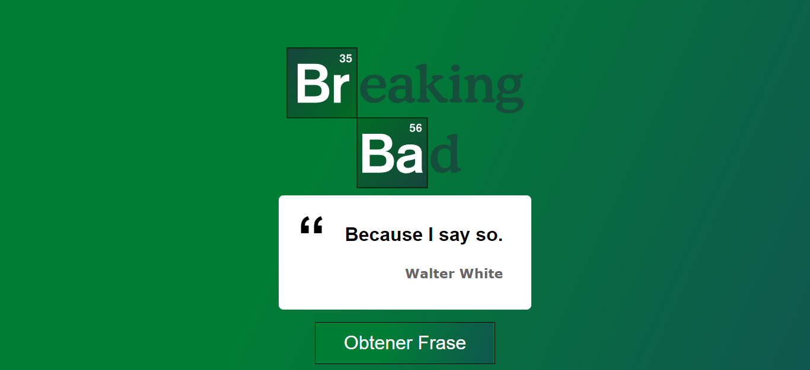

# ***BREAKING BAD PHRASES***

## Esta es una aplicación en [React](https://es.reactjs.org/) que permite  hacer un seguimiento de las tareas que se deben realizar. 

## Haciendo click [aquí](https://github.com/ReyMga/Breakin-Bad--Phrases) podrás comenzar a disfrutar este proyecto! 

## 👨‍💻 Si querés tener el código en tu computadora, deberás seguir estos pasos en tu terminal:

 ✔️Ir al repositorio
  
 ✔️Darle click al botón de forkear
  
 ✔️Darle click al botón de code
  
 ✔️Abrir tu terminal y poner el comando de git clone <url>
  
 ✔️Entrar a la carpeta del proyecto y abrirlo en tu IDE 
  

### Y listo! Podrás disfrutar de este proyecto 🤗

